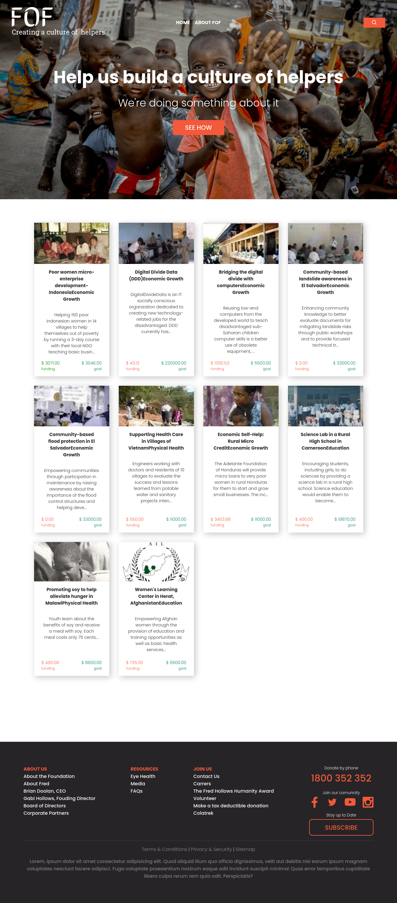
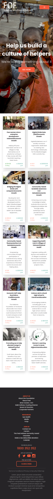

<h1 align="center">
    
</h1>

# FOF - Foundation of Foundations

Este site foi baseado em uma das ideias dadas pelo repositório [app-ideas](https://github.com/florinpop17/app-ideas).

Ele tem a proposta de ser um centro de instituições de caridade que precisam de ajuda para continuarem socorrendo pessoas necessitadas.

O site utiliza a API da Global Giving que nos proporciona as informações em XML.

[FOF](https://kaio-matos.github.io/FOF/)

## Imagens

### Tecnologias utilizadas

- React JS
  - React Icons
  - React Router Dom
- Typescript
- Xml - Js
- HTML
- CSS

<a href="https://www.linkedin.com/in/kaio-matos/" target="_blank">
  
<a/>  
